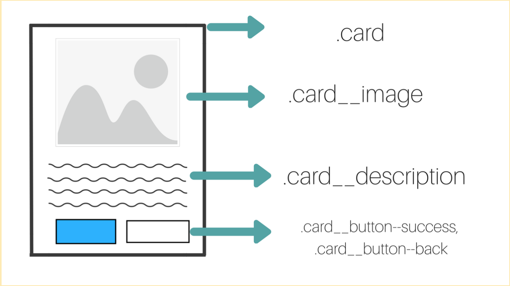

# Sass
Os arquivos que usam Sass têm uma extensão diferente do CSS, sendo .sass ou .scss.

As principais vantagens de usar o Sass são a facilidade na escrita e sintaxe, e a possibilidade de adicionar funções, mixins, nestings, seletores e herança.

## Nesting
Nos permite aninhar seletores CSS de maneira semelhante. O aninhamento é um atalho para a criação de regras CSS.  
## Parent Selector
Parent Selector, o `&`, é um seletor especial, usado em seletores aninhados para se referir ao seletor externo.

## Padrão BEM
BEM é um padrão de nomenclatura para manter o projeto simples e organizado.
A sigla BEM significa **Block Element Modifier**, em português, Bloco, Elemento, Modificador.

### Prós do BEM
- BEM deixa o nosso CSS com uma estrutura modular.
- Por conta dos nomes únicos, não acontecerão conflitos entre as classes, o que facilita a manutenção.

### Contras do BEM
- Às vezes, os nomes das classes ficam muito compridos ao se usar a metodologia

# Comando e links interessantes
### Instalar o sass
`npm install -g sass`

### Compilar .scss p/ css
`sass style.scss:style.css`

### Monitorando alterações automaticamente do scss
`sass --watch style.scss:style.css`

### Link para obter um style removendo todos os estilos padrão do HTML
https://meyerweb.com/eric/tools/css/reset/reset.css

### Monitorando alterações automaticamente do scss dentro de pastas
`sass --watch scss/style.scss:css/style.css`

# Referências
Projeto base: https://github.com/alura-cursos/projeto-sass